# Speed Camera

This is a OpenGL-based program that measures speed of objects in a video.

## Process flow

To utilize the hardware on both CPU side and GPU side and reduce stall time, the program will use two threads, one for data reading, one for actual data processing and OpenGL control. Furthermore, most of the OpenGL operations are asynchronized, meaning these routines on the CPU-side only put the commands in a queue and return immediately, the GPU will perform commands in the queue while CPU is performing other tasks.

### Stage 1: Read the video stream

Reading data from I/O is costly. I/O access is generally slower than the CPU; therefore, reading data from I/O will block the process and stall the program. The larger the size of the data, the longer the stall. 

To solve this problem. A reader thread is used to perform I/O operation. Two buffers are used, one buffer (front buffer) is used by the main thread, another buffer (back buffer) is used by the reader thread. 

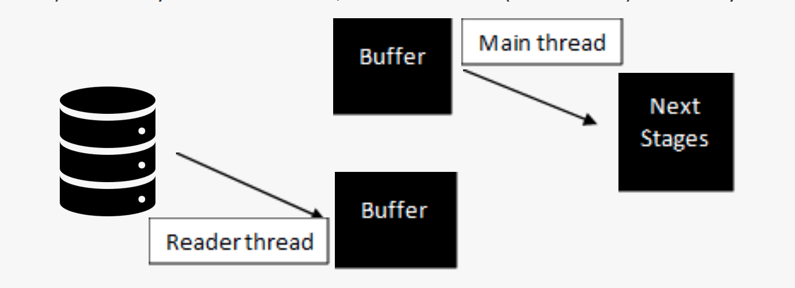

At the beginning of each frame, the main thread will pass the address of the back buffer to the reader thread, so the reader thread can begin to read video data into that back buffer. The reader thread not only reads data from I/O into memory, but also performs some pre-processing, such as format conversion. 

Each reading operation will have costs associated to program/kernel context swap and file system overhead. To reduce the number of read operations hence boost the performance, the reader thread will read a block of pixels at a time. Since most video formats require the image data be in at least 8*8 pixels macroblock, the reader will read 64 bytes at a time. 

Each macroblock is then saved in a temporary buffer. The favored format for OpenGL is RGBA; however, video stream may come with different formats, such as YUV, RGB, BGR. Although the OpenGL driver allows the client to upload texture in different formats and the driver/hardware will perform the format conversion, they are slower than uploading data in RGBA format. Therefore, the reader thread will convert the format of each macroblock; hence, the main thread and the GPU will not suffer from the delay of converting data format. 

While the reader thread is reading and pre-processing the data from I/O, the main thread can work on the front buffer, uploading the content in the front buffer to GPU. 

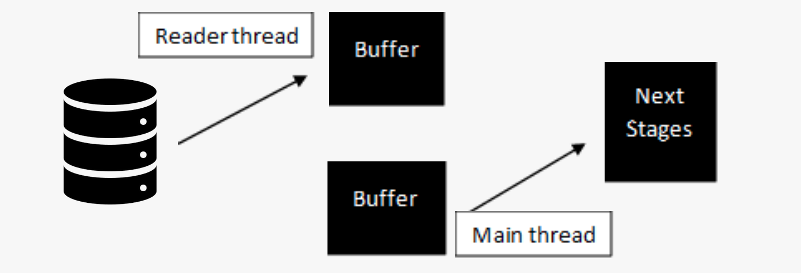

At the end of each frame, the main thread will first wait for the reader thread to finish the reading of back buffer. Once the reader thread finished the reading, the main thread will swap the front and back buffer. Therefore, the back buffer of current frame becomes front buffer of next frame, so the main thread can upload the updated content in back buffer of current frame to GPU next frame; the front buffer of current frame becomes the back buffer of next frame, which can be used by the reader thread for new data reading. 

There are two way to perform the data uploading. One way is to use conventional memory space provided by ```malloc()```; another way is to use GPU pined memory space provided by OpenGL pixel buffer object, or PBO. Both methods achieve the same goal, to upload data to GPU as texture. 

For the conventional memory space method, the reader thread will need to upload data from I/O into a memory space in program’s address space. Then, a ```glTexSubImage()``` call in the main thread will copy the content to a pinned memory space that is directly accessible by GPU hardware. The data is not directly uploaded to GPU, a DMA controlled by OpenGL driver and the hardware will later perform the actual uploading to GPU when it is ready. 

For the PBO method, the main thread will request the OpenGL driver to map a PBO pined memory to a user accessible space by a ```glmapBufferRange()``` call. Then, the reader thread will upload data into this pined memory. Finally, a ```glUnmapBuffer()``` call followed by a ```glTexSubImage()``` call by the main thread will request the DMA to transfer the data from this PBO pined memory to actual texture in GPU. 

Using the conventional memory space method requires uploading the data into an intermedia memory, then copy that memory into pined memory; while using the PBO method can directly upload the data into the pined memory, avoids the extra memory copy. However, there is no significant performance difference between these two methods. Probably because the size of each frame is small (3.6M pre frame for 720p RGBA8 video), and the memory copy is handled by OS using some aggressive memory strategies, such as block copy.

### Stage 2: Upload the data to GPU 

Once the video frame data is read from I/O and available in program’s or pined memory space, the program can upload the video frame to GPU in order to start the actual data processing. 

The uploading is in fact a DMA memory transfer operation from CPU side to GPU side, which suffers from the bandwidth of system bus and availability of the free DMA hardware. This operation will stall the OpenGL command queue. If any of the following commands and shader programs needs to access the video data, it must wait until the required data is uploaded to GPU texture storage, hence the command queue is stalled. 

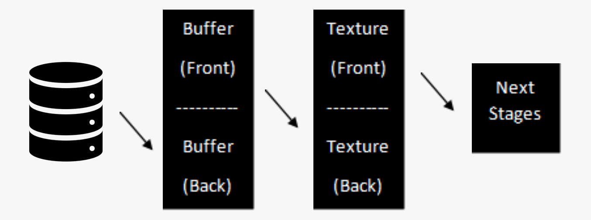

To solve this problem. The program will have to use two textures ```texture_orginalBuffer``` to store the video data, one texture (front texture) is used in the following shader programs, another texture (back texture) is for data uploading in the background, performed by asynchronous DMA. In another word, the shader program only accesses video data that is uploaded in the previous frame and read to be used in current frame; while the video data of current frame is uploaded in the background and will not be used until next frame. This avoids stalls but introduces a 1-frame latency. 

At the beginning of each frame, the program will upload video data of current frame to the back texture. While the OpenGL driver and the hardware preforming DMA on the back texture, the program and GPU only uses front texture which contains the video data from previous frame. 

At the end of each frame, after the video data of current frame is ready in the texture buffer, the program will swap the front and back texture. Video data in the back texture of current frame becomes accessible data in the front texture of next frame. Video data in the front texture of current frame can be discarded so the space can be used for uploading in next frame on the background. 

### Stage 3: Processing the data in CPU and downloading processed data 

At this stage, the video data is available and directly accessible for GPU shader programs as texture. The shader programs will use framebuffer object, or FBO, for off-screen rendering when processing the data. An A-B-A-B pattern is used, shader stage-1 will render from FBO-A to FBO-B, shader stage-2 will render from FBO-B to FBO-A, and so on. Several results are saved in special FBOs so they can be for asynchronous downloading or for reference in following frames. 

In detail, the shader program stages are as follow: 

#### 1 - Blur 

At the beginning, a Gaussian blur filter is applied on the raw video frame. This is used to remove high-frequency noise from the video frame, such as white noise and boundary of macroblock. The result is saved in one of the front-back FBO buffer pair called ``fb_raw```. 

#### 2 - Compare 

To detect moving objects, the program will compare the current and previous frame. If there is a moving object, the color value of that pixel is likely to be changed; if there is no moving object, the color of that pixel is likely to stay the same. 

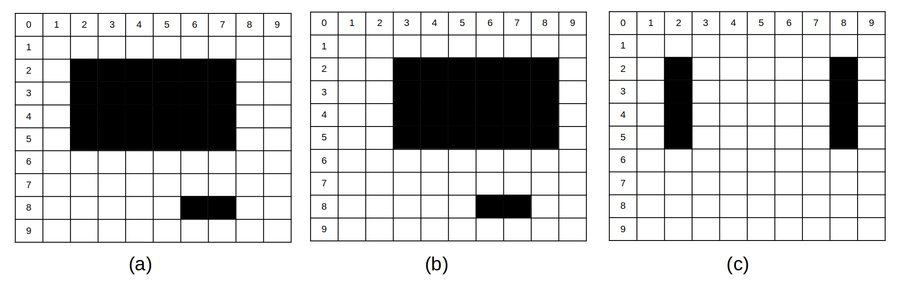

This figure shows how the comparison works. From (a) to (b), the upper object moves right for one tile, the lower object does not move. By subtracting (a) and (b), (c) highlights an area containing moving objects. In the shader program, the shader will compare front (current frame) and back (previous frame) of ```fb_raw```. This gives several blobs indicating the positions of moving objects in the scene. 

However, this algorithm is not detecting objects and then highlighting object that is moving; in fact, it is detecting the side effect of moving object, which is the change in RGB value of pixels. As the figure shows, this algorithm does not detect the upper object, it only detects the change of color on both sides of this object. 

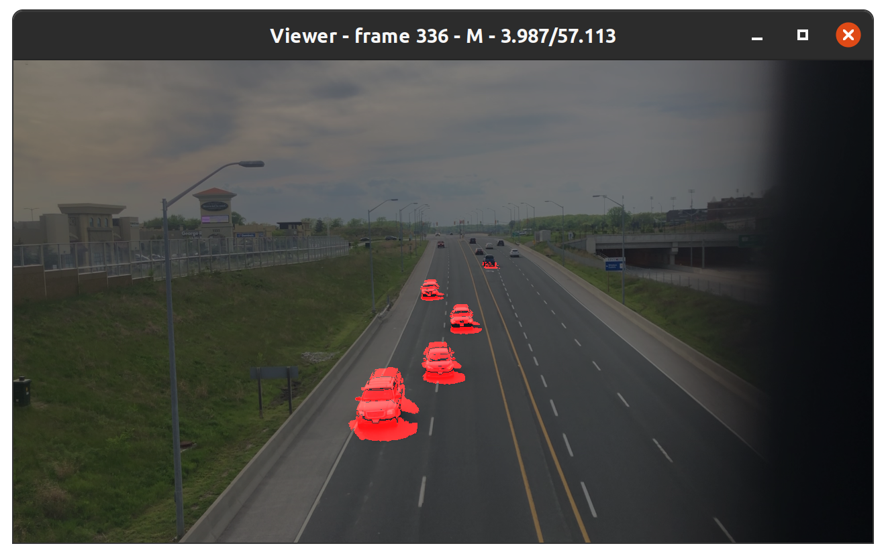

This algorithm works quite well for small sedans, these types of vehicles have distinct colors on different portions. For example, a white car normally has a black bumper, a white engine cover, a black wind shield, and a white roof.  

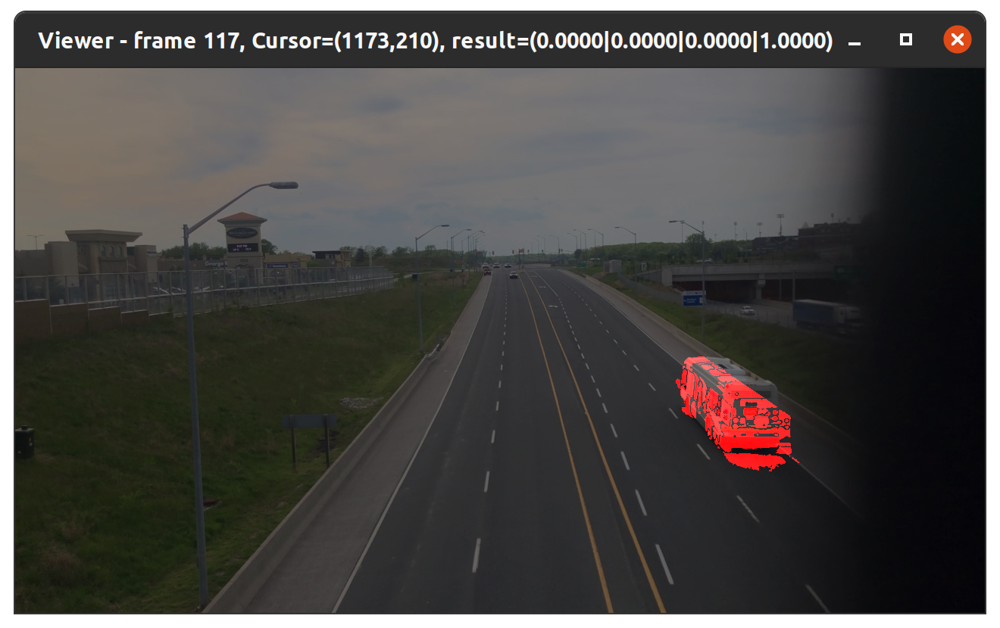

Larger vehicles like container trailer and bus have a huge flat surface of a single color; hence, this algorithm will not work as well as it has on smaller vehicles. The above example shows the result of applying this algorithm on a bus, it gives a large number of small, separated blobs. 

To fix this problem, a second stage shader program is used. In this program, the shader will group the blobs that are close to each other together to form a single blob that indicates the moving object. A roadmap containing the width of each pixel in the road-domain is used to determine the threshold distance between each blob when performing the grouping. This threshold is about half of the width of most road vehicles in road-domain. For objects closer to the screen, this threshold is larger than that far from the screen in screen-domain, because objects closer to the screen look larger than objects far from screen in perspective view. 

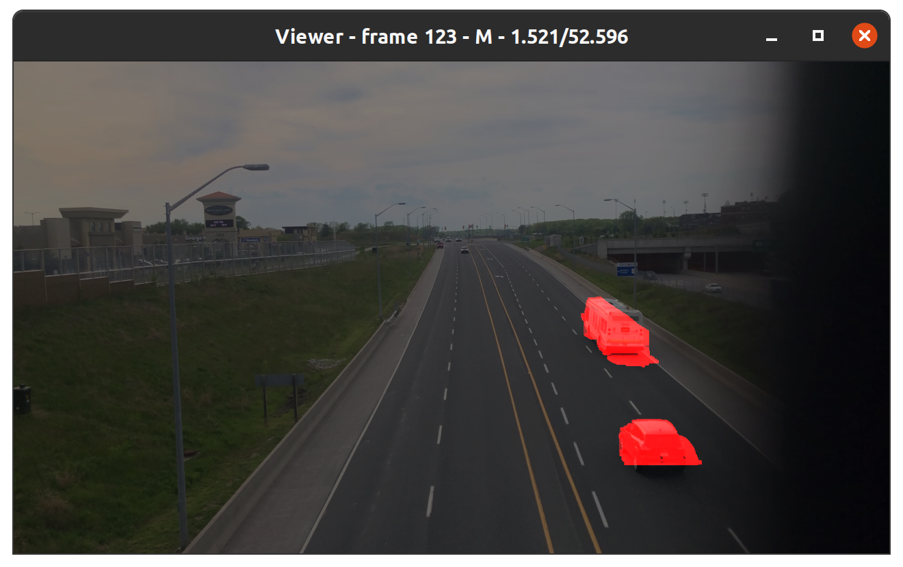

The above graph shows the comparison result after the fix. In this example, small blobs are grouped together to form a single larger blob that covers the moving object in the scene. The threshold makes sure that blobs of different objects will not be grouped together. 

#### 3 - Edge detection 

Most imaging processing algorithms will find the center of each object to form a single point of reference, and then measure the speed of that center reference point. To do this, the program needs to find the center of mass of each blob provided by the previous stage. This is easy to perform in CPU; however, for tile-based rendering GPU, the shader programs are executed on every pixel. Hence, this method is not favored. Furthermore, this method suffers from overlapping objects. When two objects overlap with each other, the program will find the center of mass of the combination of these two objects. 

In contrast, we will not find the center of mass and measure the speed of this center point. We will find the edge of the object, then measuring the speed of each single pixel of the edge. This eliminates the issue of overlapped objects. 

Furthermore, we will only use the center portion of lower edge of objects. There are a few reasons for using lower edge: 

- The lower edge is closer to the ground; hence the result is more accurate. 

- The lower edge of vehicles is normally bumper, that are flat and have a straight edge; upper edge of some vehicle may not be a straight line. 

There are a few reasons for using the center portion of the edge: 

- To remove small objects (noise or unwanted by-product of the blob fix of pervious stage). 

- To prevent search overshot in next stage. 

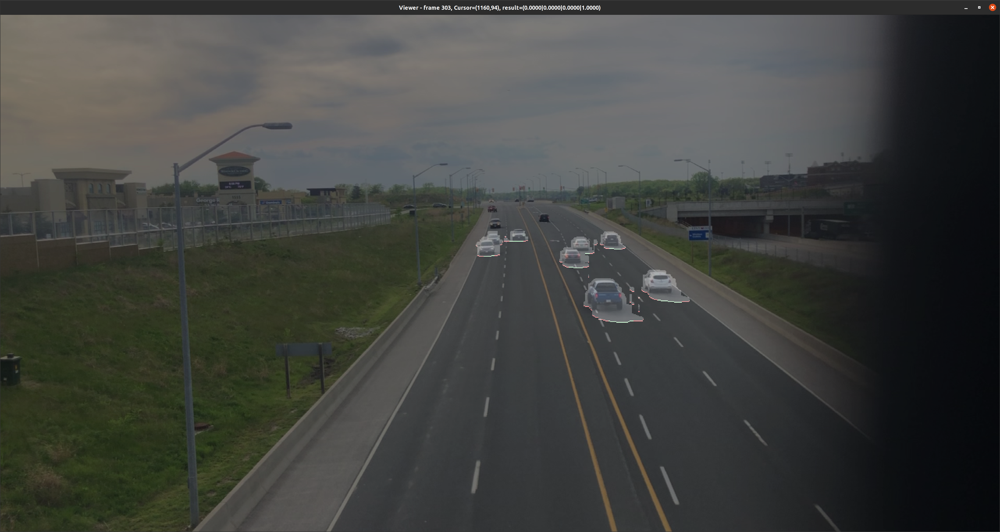

In the above example, the grey area is the result of previous moving object detection. The red line at the lower edge of each blob was donated by the edge detection. The green line shows the centered portion of the lower edge. 

#### 4 - Speed measure

To measure the speed of objects, the program measures the difference of road-domain location between two frames of each centered lower edge. 

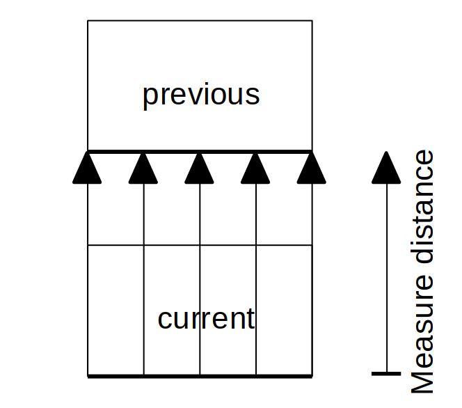

In most cases, especially when the time interval between frames is small, the position of an object in the current frame is close to its position in the previous frame. Therefore, the program does not need to track each individual object in the scene; instead, for each object in the current frame, the program only needs to search for the object in the previous frame with closet distance. In the example below, there are two objects in the scene, A and B. A and B is the position in current frame, A’ and B’ is the position in the previous frame. It is clear to say that A’ is closer to A than B’ to A, B’ is closer to B than A’ to B. 

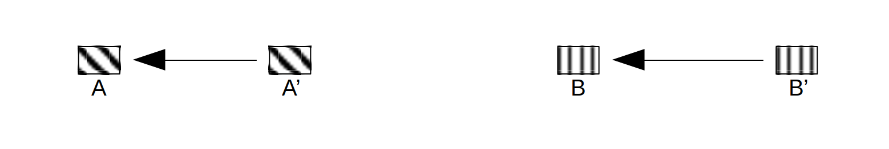

However, this creates another issue. For the example scene we used, when the video is captured at 10 FPS with 1280 * 720 pixels resolution, objects normally travel at 2 to 3 pixels pre frame in screen-domain at the center of the scene. In another word, the result comes with 33% error due to resolution. 

One way is to increase the resolution of the camera. Upgrading the camera from 720p to 1080p could reduce the error by 1 - 720 / 1080 = 33%, however, this increasing the workload by (1920 * 1080) / (1280 * 720) - 1 = 125% and increase the cost of this system. 

Another method is to increase the length of intervals. Instead of measuring the difference between current and the immediate previous frame, the program creates a FIFO framebuffer ```fb_object```. At each frame, the program pushes the current frame into this FIFO and discards the oldest frame out the FIFO. The program then performs the searching and measuring using the current frame and the oldest frame. This method uses the average speed of multiple frames and gives a better result. However, because this is an average speed, it cannot measure the instant speed of the object when its speed is changing. Furthermore, the depth of the FIFO needs to be chosen carefully. The interval between the current frame and the oldest frame in the FIFO should be less than the time a car used to travel across the distance between two cars. 

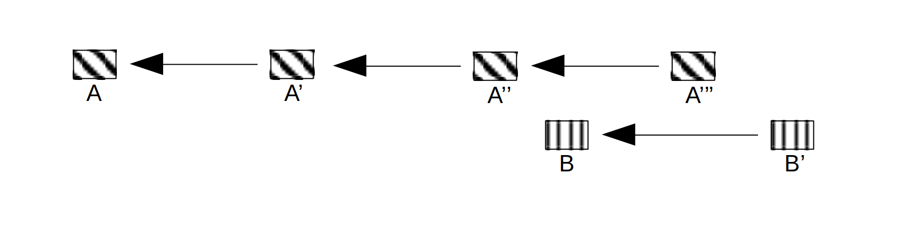

Here is an example of bad FIFO depth choice. In this example, A and B are the current position of two objects. A’, A’’ and A’’’ are the first, second and third buffer in the FIFO. When searching for the closest object to B to measure the speed of B, the program may pick A’’ or A’’’ instead of B’’’; hence provide error result. A solution is to require the program to find B’, B’’ and B’’’ in a row to prevent it mistakenly taken A’’’; but, this will substantially increase the complexity of the program and affects performance.  

Before the measuring, the program will first project the scene from perspective view into orthographic view. Consider the following scene, a vehicle travelling alone lane D will not travel vertically on the screen. This makes tracking objects on lane D tricky.


To compensate for this issue, the program can project the scene into an orthographic view shown in the following scene. By doing this, objects travel along the lane now move vertically on the screen.


At this stage, objects travel vertically in the screen-domain. To track any object, the program only needs to search upward or downward. This dramatically reduces the complexity of the program; hence improves performance. 

However, vehicles may perform lance change, which makes them not travel perfectly vertical on the screen. Furthermore, the change of width of road (like the adding turning lane in the above example) distorts the near lanes, causing objects not traveling perfectly vertical on the screen. The figure below shows an overshot of searching when the object is not traveling perfectly vertically. 

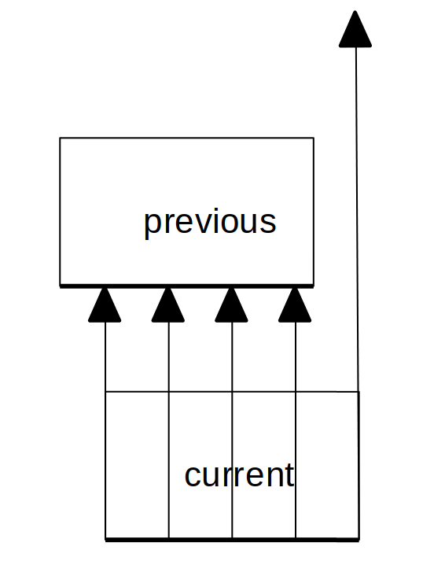

In the above example, the object moves right when it travels downwards. When measuring the distance between the current lower edge to the previous lower edge of this object, the search starting from the right side of the edge overshot the object. The search will end when it hist another object, which gives the distance between this object to another object; or exceeds the search limit defined by the roadmap, which returns zero. In either way, this will give the wrong result. 

To compensate, only the centered portion of the edge is used when performing the measuring. 

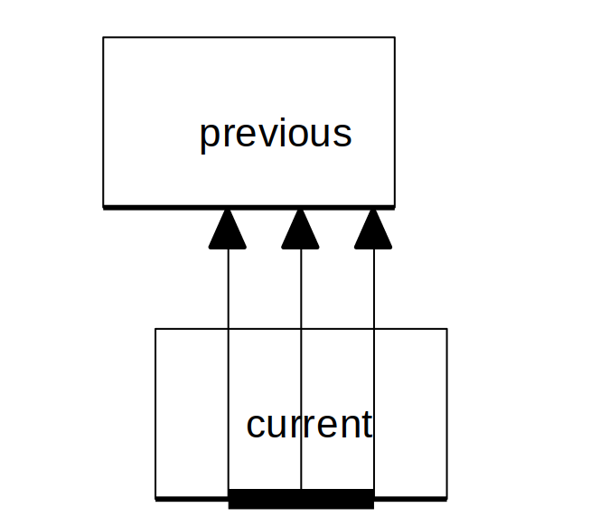

In the above example, the program only performs searches starting from the centered portion of the edge, which reduces the chance of the search overshoots. As long as the horizontal move is less than the width of the side portion of the edge, all the searches could be intercepted successfully to avoid overshot. 

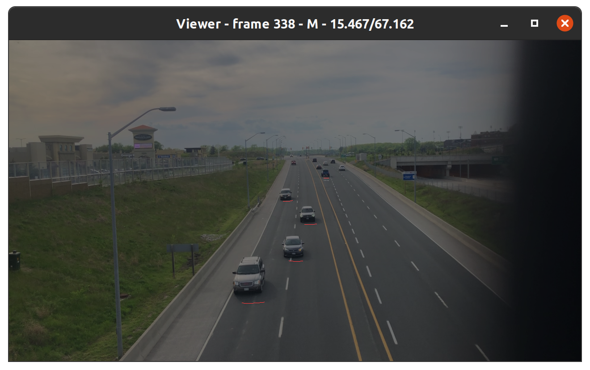

The above graph shows the result of the measure. Pixels on those red lines contain value that represents the result of the road-domain distance from that pixel to the nearest edge pixel in previous frame divided by the time interval, which is equivalent to the speed of object attached by that pixel. 

#### 5 - Group to from single points

The last stage gives speed value on each individual pixel on the “center lower edge”. Since the “center lower edge” is a continuous line for each object, group each pixel on a continuous line and average the value can give the speed of an object. The result is saved in the FBO ```fb_speed``` so it can be exported later. 

### Stage 4: Download speed data from GPU to CPU and upload processed data to GPU

At this stage, the shader programs in GPU has find the speed of objects, the result is saved in framebuffer object ```fb_speed```.  To export the result, the program must download this FBO from GPU to CPU. 

After the program on the CPU side calls the last shader program, in fact, the program on the CPU side only puts the command in the queue, the actual shader has not been executed on the GPU side; hence, the data is not ready. If downloading the speed data in FBO, the OpenGL driver will stall the program on the CPU side until all the commands in the queue are finished and the FBO is ready. 

Text BoxTo solve this program, a buffer call ```speedData``` is used. This buffer stores the result of previous frame and it is updated at the very end of each frame.

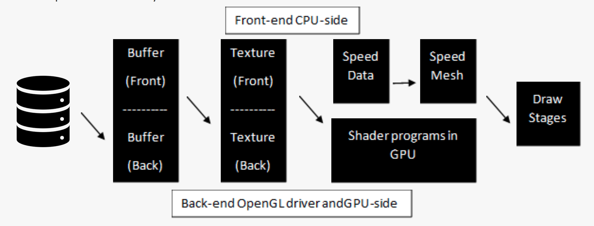

After the program put commands in the OpenGL queue, while waiting the GPU processing all the commands in the queue, the program on the CPU-side can process speed data of previous frame saved in the buffer ```speedData```. 

To display the speed on screen, the program will need to construct a mesh that contains the position and name of glyph representing the speed according to the speed data in ```speedData```. Generally speaking, the size of the mesh is about the number of objects in the scene, which is not large. Asynchronized uploading does not provide any significant performance gain; furthermore, asynchronized uploading will introduce another frame of latency. A ```glBufferSubData``` call with ```STREAM_DRAW``` is sufficient to upload the VAO which draws the glyphs on the screen. 

At the end of each frame, the program will download the speed data from FBO ```fb_speed```. If the GPU has processed all shader programs at this point, this call should return immediately after download the data from GPU to the buffer ```speedData```. If the GPU has not fully executed all commands in the queue, the program on the CPU-side will stall until all executed. Furthermore, this call can also be used as a synchronize point to make sure the program on the CPU-side will not run-over before the current frame is fully processed. Using asynchronized downloading with PBO is not favored in this step, although it may boost performance significantly by using DMA once the data is ready on GPU-side rather than stall the program on the CPU-side; it will require explicitly manual synchronize to prevent program on CPU-side run-over. 

### Stage 5: Draw on screen

To display the speed of object on screen, the CPU upload a mesh including the position and name of glyphs according to the speed data of previous frame. Shader program in GPU will draw a number of boxes on the screen, using the glyph as texture to fill these boxes. 

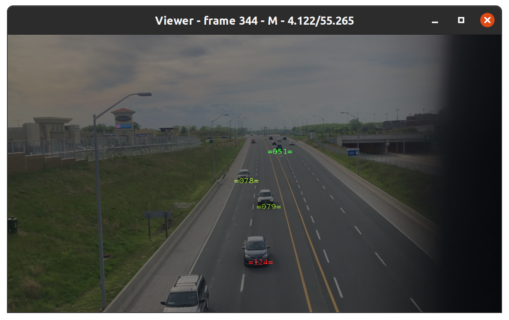

The result is then blended with the original video frame ```texture_orginalBuffer```.

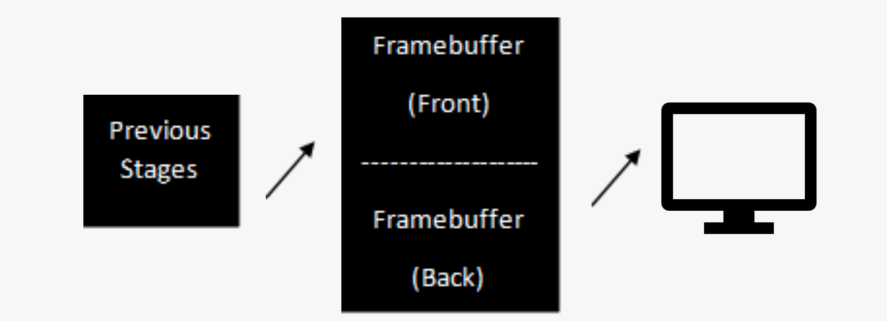

At the end, a ```glfwSwapBuffers()``` call will swap the front and back buffer of the OpenGL context. Framebuffer in the OpenGL will be swapped with the framebuffer of the window system, the final result then been display on screen. 