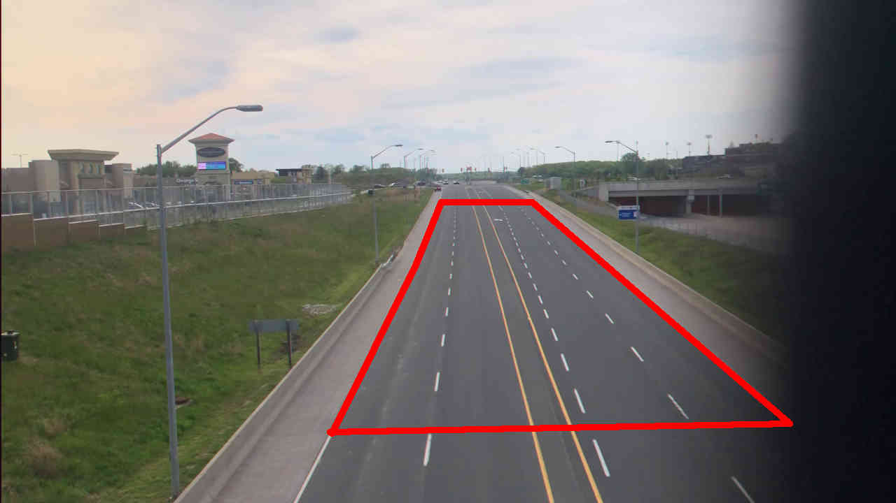
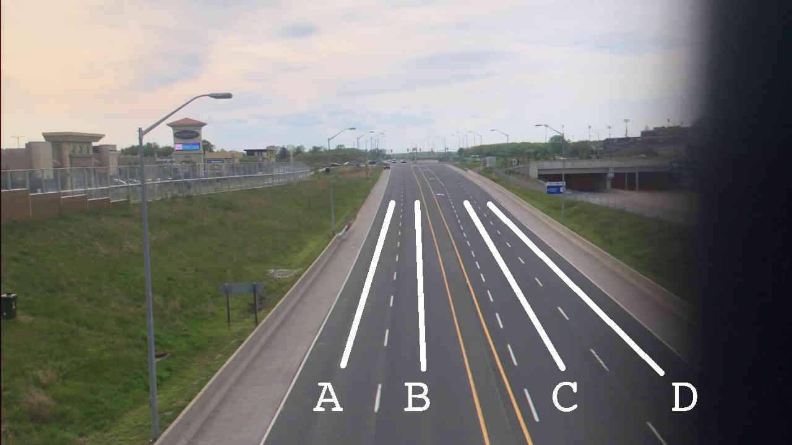
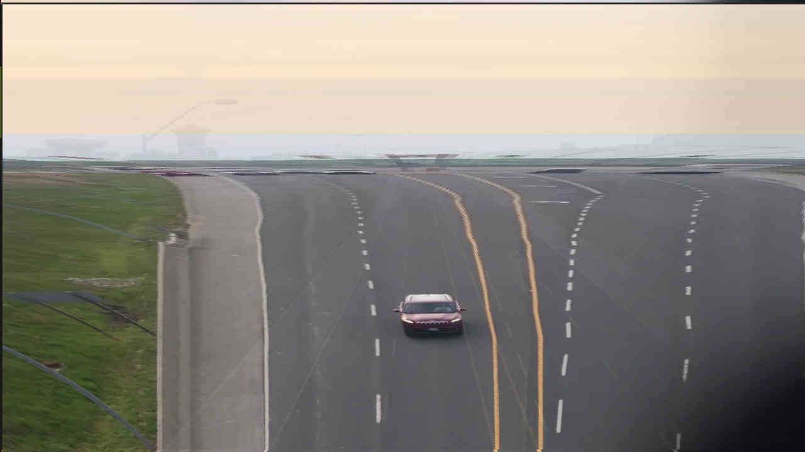
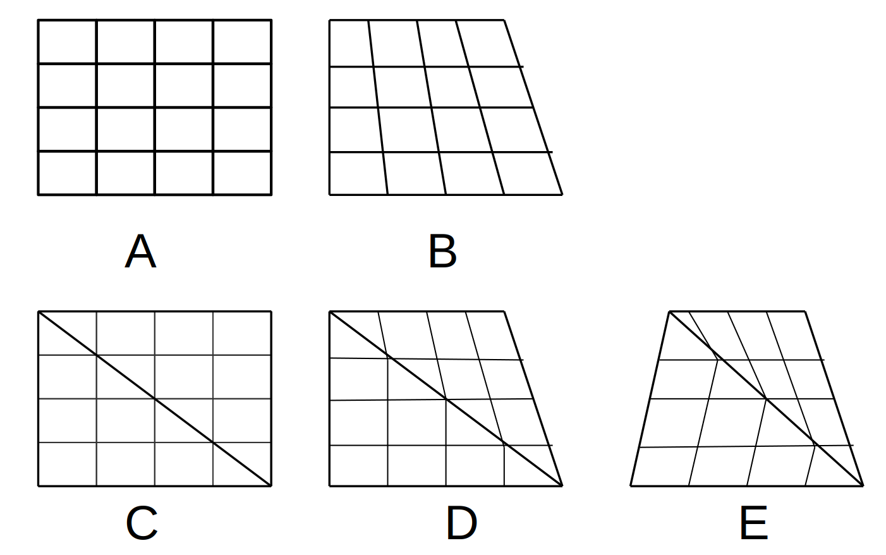
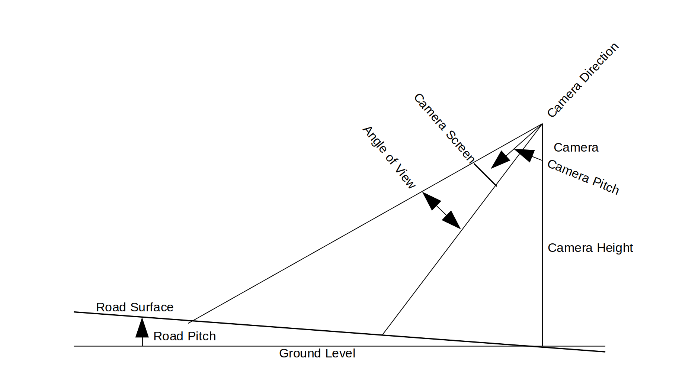
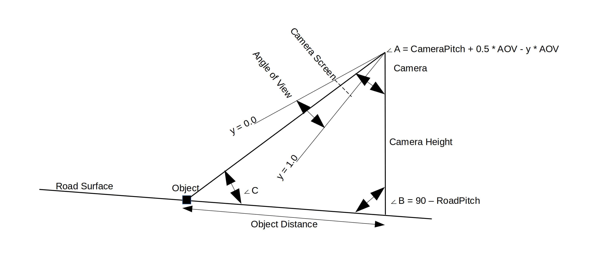

# Roadmap

A roadmap is a binary file that provides road-domain information associated with screen-domain pixels. 

This information is used to help the program to understand the scene in the video. There are four purposes of using the roadmap. 

First, the roadmap defines a region called "focus region". The focus region encircles an area in the video that the program should process. Everything out of the region can be ignored. 

Second, the roadmap gives the associated road-domain location for each screen-domain position. For example, if there is an active pixel at screen-domain position (x=30px, y=27px). The program can look up the roadmap, convert that position into road-domain location (x=3.5m, y=7.2m). Which means, there is an object at that geographic location. 

Third, the roadmap defines the search limit. A search limit is maximum distance an object could reasonably. While searching, the program should stop when it reaches the limit. 

Last, the roadmap provides a lookup table used to transform the video between orthographic and perspective view. 

## Terminology

The following terminologies are used in this document.

There are two domains when we describe the program and the roadmap: **Screen-domain** and **Road-domain**. Generally speaking, _computer_ "think" in screen-domain, it reads and draws pixels in screen-domain; while _human_ look the pixels on screen but can realize objects in **Road-domain**. A better terminology is "world-domain", but for this program's purpose, since we are studying objects on road, we will use "road-domain". 

In screen-domain, there are three types of coordinate systems: 

- The first one is absolute pixel system, where we will always refer the top-left corner of the screen to (x=0px, y=0px), and refer the bottom-right corner to (x=```width```px, y=```height```px). 

- The second one is normalized device coordinate, or NDC, which is used in openGL vertices. We will always refer the bottom-left corner to (-1.0, -1.0), and refer the top-right corner to (1.0, 1.0). We will not use this system in roadmap. 

- The third one is normalized texture coordinate, or NTC, which is used in openGL texture. We will always refer the top-left corner to (0.0, 0.0), and refer the bottom-right corner to (1.0, 1.0). 

In road-domain, we will always refer the origin point (anchor location of the camera pole) to (x=0m, y=0m). We will always refer forward to +y axis and backward to -y axis; and always refer left to -x axis and right to +x axis. 

When we refer to the coordinate in this document, we will use (x,y), the first element is the x-axis coordinate, the second element is y-axis coordinate. This document uses two ways to differentiate road-domain and screen-domain coordinates: 

- (rx,ry) means road-domain coordinate; (sx,sy) means screen-domain coordinate. In this notation, "r" means road-domain; "s" means screen-domain. This notation is used when there is no actual coordinate value. 

- (3.5m, 7.3m) means road-domain coordinate, (98px, 128px) means screen-domain coordinate. In this notation, "m" (meter) is a road-domain unit, commonly used to describe the geographic location; "px" (pixel) is a screen-domain unit, commonly used to describe the pixel on the screen. This notation is used when there is actual coordinate value. If there is no unit, like (0.5, 0.8), it means screen-domain DTC. 

**Object**: Object means everything on road-domain. An object can be a car, a truck, or even a deer. 

**Pixel**: Computer lacks the ability to realize objects. In computer's point of view, everything are pixels. Some objects take one pixel, some objects can take multiple pixels. 

**Location**: Location is used to describe where an object is. This terminology is used in _road-domain_. Sometimes we use "geographic location" to exclusively state this terminology is for road-domain. An example is ```location (x=3.5m, y=7.2m)```, note the unit is in meter (m). 

**Position**: Position is used to describe where a pixel is. This terminology is used in _screen-domain_. Examples are ```position (x=30px, y=27px)``` and ```(x=0.3, y=0.95)```, note the unit in pixel (px) or no unit. 

**Threshold**: For roadmap, the threshold means the maximum reasonable distance an object can travel during a given duration. Any object faster than the threshold will be ignored. This terminology is used in road-domain and has a unit of m/s. 

**Search distance***: Similar to _threshold_, but in screen-domain. The "search distance" gives the maximum distance a pixel can move between two frames. Any pixel moving exceeding this value will be ignored, as the moving distance is greater than the program's search distance. The unit is pixel/frame. 

**Video**: The video is a data stream feed to the program that contains the video of objects moving on the road. Source of video can be camera device, or a file, or anything that can feed a ```pipe```. 

**Focus region**: A 2D mesh defined area. The focus region encircles a screen-domain area of the video frame that SHOULD be processed by the program. Pixels out of the focus region MAY be ignored. 

## Purpose of roadmap

### Focus region

In most cases, the road only occupies a portion of the video frame. 

Instead of processing all pixels in the video, the program should only process pixels that are on the road. Doing so not only saves computation power by reducing the number of workload pixels; but also eliminates noise outside of the road. For example, if there is a high-speed railway alongside a 50 km/h road, without using focus region, every time a train passing by will trigger the speeding alarm. 

Therefore, the roadmap will provide the program a focus region. A focus region is a list of points on the screen-domain that defines the boundary of the road. 



This image illustrates the purpose of the focus region. In this image, the road takes less than 1/3 of the entire image. By ignoring the area outside the rad box, the workload could be dramatically reduced. 

The focus region is not intended to be processed by CPU. The program should construct this list into a mesh (technically speaking, a vertices array object, or VAO) and pass them to the GPU. During the fragment shader stage, the GPU will use hardware interpolation unit to determine whether a pixel is inside or outside of the focus region. The fragment shader will only process pixels in the focus region.

### Conversion between road-domain location and screen-roadm position

In real life, when we need to measure the speed of an object, we usually measure the change of geographic location of that object in a duration. Since ```speed = distance / time```. If an object travels 5 meters in 1 second, the speed of that object is 5 m/s, or 18 km/h. 

However, for computers, there is no location but position. Computer cannot directly realize the distance an object travels in a duration in road-domain. All it sees is that a pixel travels from position (sx1,sy1) to position (sx2,sy2) in the time of a frame. In order to find the road-domain distance the object travels, we need to convert the screen-domain starting position and ending position into road-domain locations. 

The purpose of roadmap is to instruct the program to convert the two points, from screen-domain position (sx1,sy1) and (sx2,sy2) to road-domain location (rx1,ry1) and (rx2,ry2). 

The last step is to perform calculation using the converted road-domain coordinates. 

```
lookup(roadmap, (sx1, sy1)) => (rx1, ry1);
lookup(roadmap, (sx2, sy2)) => (rx2, ry2);
distance = sqrt( (rx1-rx2) ^ 2 + (ry1-ry2) ^ 2 );
speed = distance / frame;
speed = (distance / frame * FPS) / s
```

### Orthographic projection

In most cases, a camera is placed on a pole near the road, facing toward the direction of traffic. The view mode is always in perspective view. 

However, in perspective view, further object is smaller than closer object, and all projection lines vanished in the center point of the view plane. In another word, an object travel along the forward-backward direction in road-domain will not travel in the vertical direction in the screen-domain if it is not on the middle axis of the screen. This means, when the program is tracing an object, it cannot simply trace vertically. There will be a slope when tracing the object. This slope varies as the distance of the object from the middle axis. 



This image illustrates this problem. Objects that move alone lane B in the road-domain will be moving vertical in the screen-domain; but object move alone lane D in road-domain will be moving in a sloped direction in the screen-domain. 

One way is to add consideration of the slope when tracing the object. The slope can be calculated at compile time, during program initialization, or on-the-fly by the GPU every time a tracing is performed.



Another way is to project the image into an orthographic view. In this orthographic view, further pixels are stretched horizontally, so their width will be the same as closer pixels. By doing this, objects travel along the forward-backward direction in road-domain will now travel in the vertical direction in the screen-domain no matter how far it is from the middle axis. After the projection, the program can simply trace in the vertical direction without worrying about the slope. 



A __naive__ idea is to encode the transform into vertices array and take the advantage of GPU interpolation in fragment shader. In this ideal case, (B) shows the result of shifting top-right vertices left from (A). In this case, we can think (B) is the perspective view and (A) is the orthographic view. In fact, GPU draw meshes using triangles instead of rectangle, refer to (C). By moving the top-right vertices, it only transforms the top-right portion of the image (D); if we move both top vertices, the result is total distortion (E). 

To perform the transformation from perspective view to orthographic view, one option is to encode a lookup table into texture and use this texture in fragment shader. There are other methods, such as preform trigonometry calculation in the shader.

The program should measure the speed of object in the orthographic view; however, when displaying the result, it should be transformed back to perspective view. So, the speed result can be aligned with object in input video. Therefore, an orthographic-to-perspective transformation lookup table is required as well.

### Search distance

When we perform speed measurement of an object, we need to know the location of that object at the beginning and ending of the duration, which are location (rx1, ry1) and (rx2, ry2). In another word, to find the speed of an active pixel at position (sx1, sy1) at frame N, we need to know that pixel's position (sx2, sy2) at frame N+1. The location (rx2, ry2) should be close to (rx1, ry1); the position (sx1, sy1) should be close to (sx2, sy2). The greater the speed, the larger the distance. 

In most cases, the program should be able to find the position (sx2,sy2) near the position (sx1, sy1). However, there are some exceptions, that there may only be (sx1, sy1) or (sx2, sy2). 

- At the moment of the object entering or exiting the focus region. 

- The program fails to detect the object in one frame, but success in another frame. 

- Noise.

In those cases, the program is only able to find (sx1,sy1) or (sx2,sy2) but not both. Therefore, the program cannot determine the speed of that object. In this situation, the program will search the entire video frame to try to find the other coordinate. This ends up wasting computation power, finding a wrong coordinate, and producing wrong result. 

To compensate for this problem, we need to define a threshold of speed. This value defines the maximum possible distance an object could possibly travel during in one video frame. The program should stop searching when it cannot find an object on this threshold. 

The threshold is a road-domain value; however, a computer is working in screen-domain. We will need to convert the threshold into search distance. The search distance is used to describe the maximum pixel distance an active pixel may travel during one video frame. 

In most cases, a camera is placed on a pole near the road, facing toward the direction of traffic. That means objects should move only in the vertical direction in the screen, with negligible horizontal movement. Therefore, when performing the search, we should only search in an up and down direction. In the roadmap, we should only define the up and down limit. 

#### Search distance v.s. limit

There are two ways to define the search distance. One way is to define the maximum screen-domain displacement that an object could travel, like this code:

```GLSL
int limit = 10;
ivec2 base = ivec2(800, 600);
for (ivec2 offset = ivec2(0,0); offset.y < limit; offset.y++) {
	texelFetchOffset(sampler, base, 1, offset);
}
```

Another way is to define the edge of search limit in screen-domain, like this code:

```GLSL
int limit = 10;
ivec2 base = ivec2(800, 600);
for (ivec2 idx = base; idx.y < base.y + limit; idx.y++) {
	texelFetch(sampler, idx, 1);
}
```

Both shaders compiled on Linux with NVidia GPU driver; however, the first one (offset displacement method) cannot be compiled on RPI4 Linux with RPI driver. Although this behavior is not documented in the [OpenGL ES 3.1 document](https://www.khronos.org/registry/OpenGL-Refpages/es3/html/texelFetchOffset.xhtml), it is suspected some OpenGL driver requires ```const``` value for the ```texelFetchOffset``` function argument. 

### The actual search distance should be determined by the program

The search distance is the maximum distance that an object could reasonably travel between two frames. Since the input video FPS is not known, the distance cannot be calculated. Therefore, it does not make sense defining the limit in the roadmap.

However, what we know now is the up and down boundaries of the focus region. Because the program should only process data in the focus region; therefore, it is clear to say that there is no object outside of the focus region, hence it is not necessary to continue the search beyond the boundaries of focus region. So, in the roadmap, we will assume the object could travel at infinite speed and use the focus region as search limit. The following strategy is used when generating the roadmap: 

- If a pixel is inside the focus region, we will use the upper and lower edge of the focus region for the search limit. 

- If a pixel is outside the focus region, this pixel should be ignored by the fragment shader. We will use the y-coord of this pixel for the upper and lower search limits. So, even if this pixel gets processed, the fragment will not perform any search on this pixel. 

## File format

The roadmap is a binary file. This file contains 5 segments of data.

### Segment 1: Header

The first segment of the roadmap file is the header. The following C code describe the header.

```C
typedef struct FileHeader {
	uint32_t width, height;
} header_t;
```

The header contains two 32-bit unsigned integers describing the dimension of the video frame and the size of this roadmap file.

This segment takes __2 * 4 = 8 bytes__.

### Segment 2: Table 1 - Road-domain geographic data

The second segment of the roadmap file is a table. This table is used to describe the road-domain geographic location associated with each pixel in both perspective view and orthographic view.

This table has ```height``` * ```width``` entries, where ```height``` and ```width``` are the same of those in the header segment. Each entry contains 4 floating-point numbers. Consider the following C code:

```C
typedef struct FileDataTable1 {
	float px, py;
	float ox, oy;
} data1_t;

int height = 1080, width = 1920;
data1_t data1[height][width];
```

For examples, if there is an active pixel on screen position (x=37px, y=29px) in the perspective view; that means, there is an object on road location (x=```data1[29][37].px```, y=```data1[29][37].py```).

This segment takes __```height``` * ```width``` * 4 * 4 bytes__.

### Segment 3: Table 2 - Search distance & Conversion lookup

The third segment of the roadmap file is another table. This table contains search distance and perspective-orthographic conversion lookup of each pixel.

This table has ```height``` * ```width``` entries, where ```height``` and ```width``` are the same of those in the header segment. Each entry contains 4 32-bit unsigned integers. Consider the following C code:

```C
typedef struct FileDataTable2 {
	uint32_t searchLimitUp, searchLimitDown;
	uint32_t lookupXp2o, lookupXo2p;
} data2_t;

int height = 1080, width = 1920;
data2_t data2[height][width];
```

The first two elements ```searchLimitUp``` and ```searchLimitDown``` donates the upward and downward search limits. The search limits are intended to be used in orthographic view. For example, if there is an active pixel at screen-domain position (x px,y px), the program should search upward until it reaches (x px, ```table2[y][x].searchLimitUp``` px) and downward until it reached (x px, ```table2[y][x].searchLimitDown``` px).

The last two elements ```lookupXp2o``` and ```lookupXo2p``` are used to transform the video between orthographic view and the perspective view. For example, if a pixel at located at (x,y) in perspective view, it will be project to (```table2[y][x].lookupXp2o```, y) in orthographic view. The transfomation is applied to horizontal direction only; so, there is no ```lookupYp2o``` or ```lookupYo2p```.

Coordinates in this table are all absolute coordinate, unit is in pixel.

This segment takes __```height``` * ```width``` * 4 * 4 bytes__.

### Segment 4: Focus region

The fourth segment of the roadmap file is a list of point pairs.

The first 4 bytes of this segment is an unsigned 32-bit integer ```pCnt``` that gives the number of point pairs. Followed by a list of points in the ```point_t``` data structure:

```C
typedef struct Point_t {
	float rx, ry;
	float sx, sy;
} point_t;

unsigned int pCnt = 10;
point_t points[pCnt][2];
```

We can consider a point to be a road-domain point, where its location is given by ```rx``` and ```ry```; we can also associate that road point to a screen-domain pixel, where its position is described by ```sx``` and ```sy```. 

Road points are used to describe the screen-domain focus region, encircles an area of pixels that should be processed by the program. Pixels outside of this area should be ignored. This method not only saves computation power by reducing the amount of pixel that requires processing, but also avoids certain areas that should be ignored. 

In most cases, road points are used to define the boundary of the road. Because of this, road points come in pairs. ```points[i][0]``` is always the left point, ```points[i][1]``` is always the right point. Therefore, ```points[i][0].rx``` and ```points[i][0].sx``` is always less than ```points[i][1].rx``` and ```points[i][1].sx``` respectively. 

In the road points list, the order is from further to closer in road-domain (top to bottom in screen-domain). Therefore, ```points[i][j].screenY``` is always less than ```points[i+N][j].screenY```; but ```points[i][j].roadY``` is always greater than ```points[i+N][j].roadY```.

Screen coordinates ```sx``` and ```sy``` are in DTC.

This segment takes __4 + 2 * ```pCnt``` * 4 * 4 bytes__.

## Segment 5: Meta data

The last segment stores human-readable data in ASCII format, such as comments and notes. The content of this segment is arbitrary, and the length of this segment is arbitrary. This section should be ignored by the program. 

## Size chart
- Seg 1: 8 bytes
- Seg 2: ```height``` * ```width``` * 4 * 4 bytes
- Seg 3: ```height``` * ```width``` * 4 * 4 bytes
- Seg 4: 4 + 2 * ```pCnt``` * 4 * 4 bytes
- Seg 5: DNC
- Total: (```height``` * ```width``` + ```pCnt```) * 32 + 16 bytes + DNC

## Run-time calculating based on camera orientation using trigonometry

To measure the speed of an object, it is important to find the road-domain location of that object. One way to get the road-domain location of an object is to use the pre-defined roadmap as described in the earlier sections of this document; another way is to calculate the road-domain location on-the-fly using the orientation of the camera. 

 

In this method, we will need to use the camera height, camera angle of view (AOV), position of the object in camera screen, and road pitch to calculate the distance of the object from the camera pole. In the above figure, the camera pitch is the angle between the center line of the camera and the camera pole; therefore, the angle between the upper edge of camera view plane (screen) and the angle of between the lower edge of the camera view plane will be ```CameraPitch + 0.5 * AOV``` and ```CameraPitch - 0.5 * AOV``` respectively. 

To find the distance between the object and the camera pole, we will need to draw a triangle that connects three points: the camera, the object, and the camera pole anchor on the ground. Consider the following figure: 

 

First, we need to find ∠A, the angle between the object and camera pole. When there is an object in the scene, we need to get the DTC y-coord of that object ```y```. If this object is at the upper edge of camera view plane, y will be 0.0; if this object is at the lower edge of camera view plane, y will be 1.0; if this object is at somewhere middle of camera view plane, y will be between 0.0 and 1.0. Then, ∠A will be ```CameraPitch + 0.5 * AOV - y * AOV```. 

Next, we need to find ∠B, the angle between the camera pole and the road surface. We can assume the camera pole is perfectly vertical, perpendicular to the ground level. Then, ∠B will be ```90 - RoadPitch```. ```RoadPitch``` is the slope of the road, this data can be measured when installing this system.  

We will also need to know the ```CameraHeight```. This data can be measured when installing this system. 

In triangle with angle ∠A, ∠B, ∠C and line a, b c, according to sine rule:
```
Sin(A) / a = Sin(B) / b = Sin(C) / c
```
Therfore:
```
Sin(A) / ObjectDistance = Sin(C) / CameraHeight
A = CameraPitch + 0.5 * AOV - y * AOV
B = 90 - RoadPitch
C = 180 - A - B = 90 + RoadPitch + y * AOV - CameraPitch - 0.5 * AOV
```
The result:
```
ObjectDistance = CameraHeight / Sin( 180 - A - B = 90 + RoadPitch + y * AOV - CameraPitch - 0.5 * AOV ) * Sin( CameraPitch + 0.5 * AOV - y * AOV )
```

### Pre-defined roadmap v.s. Run-time trigonometry computation in GPU

For this comparison, we use an embedded system GPU, the [VideoCore IV GPU architecture which is used on Raspberry pi 3](https://docs.broadcom.com/doc/12358545) as our reference. This comparison is theory-based. Since GPU, GPU API and OpenGL are highly abstract, the comparison may not be practical. Different GPU, different driver, different driver version, different optimization, different environment may produce different results.

#### Pros of pre-defined roadmap__

- The road coordinates will never change; therefore, it is favored to calculate the coordinates once at the compile-time, then save them for later use. 

- Avoid run-time computation-intense operation such as trigonometry, which saves time and increases performance. 

- Avoid using large amount of intermediate value generated by run-time computation. Larger amount of intermediate value may excess the cache capacity and cause expensive cache miss. 

- Support complex road conditions where the road-domain coordinates cannot be simply described by trigonometry. 

#### Cons of pre-defined roadmap__

- Uses more texture buffer, higher memory bandwidth requirements. 

- Intense use of texture and memory lookup unit (TMU). There is one or two FIFO buffered TMU per GPU slice. Intense accessing TMP stalls the slice. 

Note:
- This comparison uses VideoCore IV which is seen in RPI3 as reference. Raspberry pi 4 is more mainstream than PRI3, which uses VideoCore VI. However, there is no document available for this VideoCore VI currently. We believe that VideoCore VI may share some similarity with its predecessor videoCore IV, so we use the document of VideoCore IV for reference. However, it is also worth pointing out that VideoCore VI supports OpenGL ES3.1; but its predecessor videoCore IV only supports OpenGL ES 2.x. Therefore, there may be some fundamental difference between them. 

- According to the document, the VideoCore IV GPU may come with 1 or 2 TMUs. GPUs with multiple TMUs are favored if the usage of texture lookup is high. 

## Size of roadmap

The size of roadmap and the size of video can be different. For example, an 800*600px roadmap can be used when the input video is 720p. This same roadmap can be used when the input video resolution upgrades to 1080p. As long as the scene does not change, the same roadmap can be used for all video resolutions. 

When the video resolution matches with the roadmap size, the program can directly fetch data from the roadmap. For example, if the program needs to find the search distance of a pixel at ```(x px, y px)```, the shader will be: 

```GLSL 
vec2 searchLimit = texelFetch(map, ivec2(x,y), 1);
``` 

However, if the video resolution differs from the roadmap size, additional computation is required. This is because some data in the roadmap uses coordinates that is associated with the size of roadmap. When sizes are different, the coordinates are different as well. For example, if the program needs to find the search distance of a pixel at ```(x px, y px)``` in a video using a roadmap with different size, the shader will be:

```GLSL
vec2 roadIdx = ivec2(x,y) * textureSize(map, 0) / textureSize(video, 0); //Function textureSize(video, 0) will return video size {videoWidth, videoHeight}, LOD = 0 --> no mipmap
ivec2 mapSearchLimit = texelFetch(map, roadIdx, 0).xy; //Search distance of the map size
ivec2 searchLimit = mapSearchDistance * textureSize(video, 0) / textureSize(map, 0); //Search distance of the video size
```

The program can also use normalized coordinates. By doing this, the GPU TMU hardware performs the actual coordinate calculation. For example, if the program needs to find the road-domain location in perspective view of a pixel at ```(x px, y px)``` in a video using a roadmap with different size, the shader will be:

```GLSL
vec2 normPos = ivec2(x,y) / vec2(textureSize(video, 0));
vec2 loc = texture(map, pos).xy;
```

This method used ```texture()```. Unlike ```texelFetch()``` which accepts absolute coordinate and return the data in texture directly, ```texture()``` accepts NTC and interpolate value. When the texture filter paramter is ```GL_*LINEAR```, the TMU will perform sampling on data by calculating the weighted average of nearest four tiles (linear filter). This is especially useful when interpolation is required. For example, if we need to find the data at ```(1px, 13px)``` of a ```16px * 16px``` video using a ```8px * 4px``` roadmap, ```texture()``` will perform:

```
x: 1/16 --> ( 1 / (16-1) * (8-1) ) / 8 = 0.4667/8; x = 0.4667 * x0 + 0.5333 * x1;
y: 13/16 --> ( 13 / (16-1) * (4-1) ) / 4 = 2.6/4; y = 0.4 * y2 + 0.6 * y3;
tl = 0.4667 * 0.4; tr = 0.5333 * 0.4;
bl = 0.4667 * 0.6; br = 0.5333 * 0.6;
result = tl * map(x=0px, y=2px) + tr * map(1px,2px) + bl * map(0px,3px) + br * map(1px,3px);
```

In this example, the result is weighted average of near pixels instead of the single nearest pixel. This provides a smooth result.  

In conclusion, restricting the roadmap to be the same size as the video can simply the shader code and provide the fastest routine. However, it is sometimes worth allowing the use of roadmap in different sizes. There are a few benefits: 

- Flexibility. It allows changing input video resolution without updating the roadmap.

- It allows using smaller roadmap. Smaller roadmap consumes less memory space, increasing cache hit rate, reduce chance of stall; hence, increase routine execution speed.